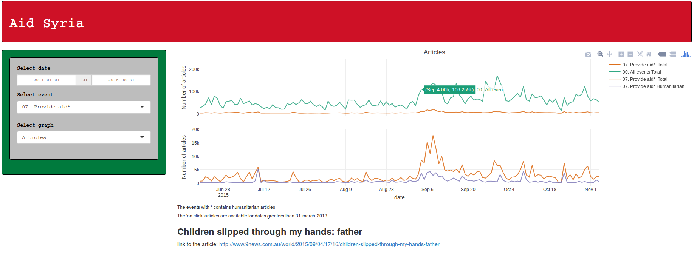

# Trabajo fin de máster 
# Máster en Data Science, Universidad Rey Juan Carlos
## Javier Gómez Maqueda 

### 1. Introducción y objetivos

#### Introducción

Desde 2011 se está viviendo en Siria una guerra civil en la que se enfrentan el gobierno sirio contra grupos de rebeldes. Algunos de estos grupos forman parte del estado islámico (Daesh) que ocupaba zonas en Irak. Lo que ha permitido al Daesh invadir territorios sirios. El conflicto comenzó en forma de protestas de civiles contra el gobierno sirio, enmarcadas en la llamada primavera árabe pero en pocos meses se tornó en una guerra civil.

La motivación principal para realizar este proyecto es responder a la pregunta: ¿Cómo utilizan los medios las noticias?. La motivación secundaria es la realización de un proyecto de Data Science completo en la que intervinieran arquitecturas cloud, procesamiento en paralelo y la construcción de una aplicación que cualquier usuario pueda utilizar.

#### Objetivos

1. Comprender mejor el desarrollo de la guerra a partir de las noticias. 
2. Conocer la repercusión que ha tenido el conflicto en el resto de países del mundo y cuándo ha ocurrido esta repercusión. 
3. Averiguar si existen correlaciones entre las peticiones de ayuda, los enfrentamientos y los envíos de ayuda. 
4. Diferenciar entre las ayudas humanitarias y las ayudas a alguna de las partes del conflicto. 

Para ello utilizaremos como fuente de datos GDELT, procesaremos la información con google BigQuery y SPARK para después construir una visualización con Rshiny

**GDELT:** GDELT Project es una base de datos abierta creada a partir de las noticias que se alojan en internet. Los registros que se almacenan son resúmenes de las propias noticias e incluyen campos como el actor principal (emisor de la acción), actor secundario (receptor), lugar, acción (siguiendo los patrones de CAMEO) y otras 52 variables asociadas a esta información. Además, a partir del 1 de abril de 2013 se incluyó un campo adicional con la URL de la noticia.

**GoogleBigQuery:** BigQuery es una herramienta cloud de Google, la cual permite realizar consultas sobre tablas que estén almacenadas en el warehouse de google. En este caso las tablas de GDELT se encuentran en BigQuery y este es el motivo de la elección de esta herramienta. 

**SPARK:** SPARK es una herramienta orientada a procesar grandes cantidades de información en clusters.

**Rshiny:** Es una aplicación de Rstudio que permite realizar visualizaciones interactivas de la información.

\pagebreak

### 2. Fuentes de datos: The GDELT Project

El proyecto GDELT consiste en más de 2.500 millones de registros de eventos en más de 300 categorías que cubren el mundo entero desde 1979 junto con un diagrama de red masiva que permite conectar las personas, organizaciones, ubicaciones, temas y emociones. La visión de GDELT es aprovechar estos datos para construir un catálogo de comportamiento de la sociedad en todos los países del mundo y conectarlo en una red masiva que captura lo que está sucediendo en todo el mundo: el contexto, las partes involucradas y cómo se está sintiendo.

GDELT se basa en cientos de miles de broadcast, noticias impresas y online capturadas en todos los rincones del mundo en más de 100 idiomas. Además del material de noticias traducido, el archivo retrospectivo histórico de GDELT se remonta hasta 1979.

El formato de los datos es una tabla .csv y en cada registro de la tabla podemos encontrar:

*EventID y atributos de fecha:* Los primeros campos de cada registro traen su identificador único y la fecha en la que ocurrió el evento.

*Atributos de actor:* Describen las características de los dos actores involucrados en el evento. Incluye por completo la codificación CAMEO (v 1.1b3) para cada actor, esto es: nombre del actor, afiliación religiosa, atributos geográficos, etnias y el rol del actor en el contexto del evento (élite política, militar, rebelde, etc).

*Atributos del evento donde tiene lugar la acción:* Estos campos guardan información sobre el lugar donde ocurre la acción que realiza el primer actor sobre el segundo, qué tipo de acción realiza, la escala Goldstein (-10 a 10 dependiendo del impacto que tenga el evento sobre la estabilidad política del país), medidas de viralidad como el número de menciones al artículo y el sentimiento medio del artículo situándose entre -100 y +100 aunque la mayoría de los artículos se suelen encontrar en la escala entre -10 y +10.

*Metadatos:* Fecha en la que se añade el registro y URL de la noticia.

La base de datos de GDELT se puede explotar de tres formas diferentes: 

- A través el servicio de análisis de GDELT: De forma interactiva, podemos realizar consultas predefinidas a la BBDD y descargarnos el archivo, mostrar la información en timelines, mapas, gráficos cloudwords.
- A través de Google BigQuery: Las información esta cargada en la aplicación cloud. Con consultas SQL podemos personalizar las búsquedas para después descargar la información o guardarla para explotarla con el cloud de google.
- Descarga de la información en bruto: Otra posibilidad es descargar la información en ficheros .csv para un posterior tratamiento.

Se ha decidido tratar la información a través de BigQuery porque de este modo evitamos tener que subir tablas al cloud o levantar máquinas en otros clouds que realicen la descarga.

\pagebreak

### 3. Procesamiento de la información

#### 1. Google BigQuery

Como se observa en el workflow, comenzamos el procesamiento utilizando google BigQuery. Con la siguiente consulta SQL 

	SELECT
	  *
	FROM
	  [gdelt-bq.full.events]
	WHERE
	  ActionGeo_CountryCode == 'SY'
	  AND Year >= 2011
	;

Con ella se recopila toda la información a partir de 2011 de todos los eventos que han tenido a Siria como trasfondo. BigQuery tarda en realizar la consulta a la base de datos que contiene mas de 2.5 TeraBytes de información 20 segundos y reparte el resultado de 1.8 GigaBytes en 9 archivos realizando sharding que se descargan en local.

#### 2. SPARK

El siguiente paso a realizar es el tratamiento de la información con SPARK (v2.0.0). Para ello se ha creado un libro de jupyter con pyspark que contiene el código que se adjunta en el anexo:

En el primer paso se cargan las librerías necesarias y se crea el esquema de la tabla para leer los 9 archivos .csv extraídos desde BigQuery para cargarlos en un único dataframe. Después se seleccionan los eventos relacionados con Siria en las fechas de interés y se crea una nueva variable en el dataframe: 

*ImportanceTone:* Orientado a que posteriormente se va a agrupar la información, para no dar los mismos pesos a los tonos medios, se crea una medida de importancia. Esta medida es el tono medio por el número de articulos en los que el artículo del evento es mencionado. De esta forma si un artículo es muy importante, su tono tendrá más peso en el computo global que el tono del resto de artículos.

El siguiente paso que realiza el procesado es ordenar el dataframe. El sentido de ordenarlo es porque posteriormente vamos a aplicar una funcion last y nos interesa quedarnos con los artículos que cumplan los criterios. En el siguiente paso se crean cinco nuevas variables agrupando por fecha y evento:

*importanceArticle:* Número de artículos en los que es mencionado el artículo con mas menciones.

*maxArticle:* URL del artículo con más menciones.

*sumNumArticles:* Suma del número total de menciones de los artículos que comparten fecha y código de evento.

*sumImportanceTone:* Suma de los tonos prorrateados por la importancia.

*importanceTone:* Tono del artículo con mayor número de menciones.

Por último se estructura la información en 1 sólo datataframe (que estaba repartido en diferentes hilos) y se vuelca en un archivo .csv en la ruta indicada. Este archivo tiene 25 MegaBytes de información. La duración de esta parte del procesado es de 20 segundos y esta información es la que trataremos con Rshiny.

\pagebreak

#### 3. Rshiny

*Procesado:* El procedimiento que se sigue es el siguiente:

1. Definir el tipo de de variable numérico en los campos que así lo son.
2. Creación de una nueva variable para que el campo evento base se muestre de forma explícita.
3. Creación de la variable evento humanitario utilizando los códigos de evento para definir los eventos que mejoran o intentan mejorar la situación de la población Siria. Para seleccionar estas variables se ha acudido a la documentación de CAMEO y se han escogido los eventos relacionados con la asistencia humanitaria, la protección y el mantenimiento de la paz, los derechos humanos, la reducción de la violencia y la apertura de fronteras.
4. Creación de un nuevo dataframe para agrupar los datos por fecha y evento. Finalmente en este paso se crea la variable weightedTone que prorratea el la variable importanceTone por la suma total de artículos que estan interviniendo en la suma.
5. Creación de otro dataframe para agrupar los datos por fecha, evento y evento humanitario. La lógica de este dataframe es igual a la del paso anterior.

*UserInterface:* 

La interfaz de usuario que se ha creado consiste en 2 paneles, uno en formato barra de opciones a la izquierda que contiene:

- Selector del rango de fechas
- Selector del evento base
- Selector del gráfico a visualizar

Y un panel principal que contiene:

- Gráfico a visualizar: Mediante paneles condicionales se controla el gráfico que se muestra.
- Salidas HTML: Que permiten interactuar con el gráfico.
- Aclaraciones sobre la visualización.

En la elección de este tipo de interfaz se han tenido en cuenta los siguientes aspectos:

- Uso sencillo: El panel de menú en la izquierda es común encontrarlo en aplicaciones y sitios web. De esta forma se encuentra de forma cómoda.
- Selectores apropiados para cada tipo de campo.
- Importancia del gráfico sobre el menú, la proporción es 1 a 3. Al haber elegido la opción fluid page los paneles se adaptan a la pantalla donde se muestra.

*Server:*

El funcionamiento de la aplicación consiste en crear elementos reactivos en shiny, en este caso, dataframes que cambian dependiendo de las opciones elegidas en la UI. Con ellos se realizan los siguientes gráficos:

- Gráfico de artículos: Se comparan en un gráfico tipo trellis la suma artículos del evento seleccionado (por defecto proveer ayuda) contra la suma del resto de artículos y la suma de artículos del evento seleccionado contra la suma de artículos sobre eventos humanitarios de ese tipo de evento a lo largo del rango de fechas seleccionado. Los colores seleccionados pertenecen a la paleta "Dark2" que se selecciona desde la librería RColorBrewer y es una paleta amigable para personas con problemas de confusión de colores. Se ha añadido transparencia a los colores para evitar la superposición. El objetivo de este gráfico es observar el foco y la viralización de las noticias a escala mundial.

- Gráfico artículos vs tono: En esta nueva visualización se compara de nuevo en un gráfico trellis la suma de artículos humanitarios frente a la suma total de artículos del evento seleccionado y por otro lado observamos el tono ponderado a lo largo del tiempo. El objetivo de esta visualización es ayudar al usuario a entender los cambios en el sentimiento que se está teniendo sobre un tipo de artículo. Las opciones del gráfico son iguales al anterior, de nuevo, para reducir la complejidad del gráfico. En ambos gráficos se añade una leyenda autoexplicativa. En caso de que un tipo de evento no tenga artículos humanitarios (El evento no acabará en "*") la línea desaparece del gráfico.

Ambos gráficos contienen las siguientes opciones interactivas. Por un lado las que aporta plot.ly:

- Descargar
- Herramientas de zoom
- Moverse a través del gráfico
- Interacción al seleccionar
- Re-escalar
- Reiniciar el gráfico
- Opciones al posicionarte sobre el gráfico (comparativa y no comparativa)

Por otro lado, se ha añadido una interacción adicional que consiste en: aprovechando que GDELT a partir del 1 de abril de 2013 contiene la URL de cada artículo, al seleccionar un sólo punto y pulsarlo realizamos un pequeño scrapping a la web y mediante las librerías httr y XML y el lenguaje de XPATH buscamos el título de la noticia y mostramos la dirección URL como enlace por si se quiere indagar sobre una noticia. De esta manera ayudamos al usuario a entender la información, ligándolo con los eventos de una forma directa.

\pagebreak

### 4. Análisis

#### Repercusión global

Al acceder en la aplicación, lo primero que se observa es el aumento del número de artículos a partir del 15 de marzo de 2011. Es curioso ya que anteriormente había habido protestas, pero no es hasta mediados de marzo cuando comienzan a escalar a otras ciudades y a producirse los primeros enfrentamientos entre el gobierno y los manifestantes. La repercusión de las noticias globales van de la mano con las protestas hasta octubre de 2011 pero el protagonismo a escala mundial lo están teniendo las luchas. Entorno al 20% de las noticias tratan sobre los enfrentamientos. Es interesante puntualizar que al comienzo del conflicto los enfrentamientos ocurrían en las protestas (englobadas dentro de las primaveras árabes), pero la repercusión que tuvieron los enfrentamientos es mayor. En general, durante todo el conflicto las noticias sobre luchas tienen mayor repercusión y marcan la evolución de las noticias en los medios.

En agosto de 2013 se observa un salto importante en las noticias que no se corresponde con los enfrentamientos, utilizando la interacción con el gráfico se muestran noticias relacionadas con armas químicas: La ONU acusa al gobierno Sirio de estar usando este tipo de armas. En este periodo aumentan considerablemente las declaraciones públicas y las mediaciones.

Tras estas acusaciones y, por segunda vez, la repercusión del conflicto se reduce, de más de 100.000 artículos publicados durante la mayoría de días en septiembre a 20.000 artículos. La primera vez que ocurrió este hecho es en mayo 2013 que se pasaron de 20.000 a 8.000, siendo este número inferior a los momentos de inicios de las protestas.

En Agosto de 2014 el nº de noticias vuelve a crecer, principalmente debido a las noticias sobre enfrentamientos. En este periodo, EEUU, Siria y los rebeldes se alinearon para luchar contra el Daesh y comienzan los bombardeos sobre las posiciones de los yihadistas.

La repercusión se mantiene hasta septiembre de 2015. Con la crisis de los refugiados en europa ya iniciada las noticias no comienzan a aumentar hasta que llega la foto de Aylan. A partir de entonces la repercusión se mantiene hasta fecha, siendo las noticias sobre enfrentamientos y mediaciones las que ocupan la mayoría de artículos.

#### Ayuda humanitaria

Durante todo el conflicto, las noticias relacionadas con la ayuda humanitaria son escasas y apenas tienen repercusión. Durante la crisis de las armas químicas estas noticias llegan a multiplicarse por 10 pero un mes después vuelven a estar en los niveles anteriores. El impacto de este tipo de noticias no vuelve a ser importante hasta septiembre de 2015. En este momento, la suma de artículos sobre petición de ayuda es 20.000 frente a los 200.000 artículos globales. Puntualizar que durante este mes las noticias de enfrentamientos de nuevo vuelven a quedar relegadas a un segundo plano.

#### Tono global

El tono global es el sentimiento prorrateado por la importancia de los artículos que se está teniendo sobre el conflicto. Es interesante tambien conocer el contexto de las noticias ya que en una sociedad global este puede cambiar como resultado de hechos ocurridos en otros lugares. 

Antes de comenzar la guerra, los artículos sobre Siria estaban por encima del 5, es decir tenían un tono positvo bajo y al comenzar las protestas en febrero este tono se reduce a 4. 

Tras desaparecer las protestas y quedar únicamente el conflicto armado el tono baja a 2 y de repente en febrero de 2015 el tono baja a -5 que es donde se mantiene hasta la fecha. A partir de la aplicación es complicado conocer cual es el motivo de este cambio repentino. Tomando ayuda de otros recursos se podría entender que este cambio del sentimiento tan repentino se debe a los atentados en Francia a finales de enero de 2015 aunque no queda del todo claro ya que el cambio de tono se produce a mediados de febrero de 2015. La noticia más importante del 18 de febrero es que Siria se dispone a suspender los ataques aéreos sobre Aleppo que, en el contexto del conflicto, es una noticia muy positiva.

### 6. Anexo: Códigos

**SPARK**

	from pyspark.sql import SQLContext
	from pyspark.sql.types import *
	from pyspark.sql import functions
	sqlContext = SQLContext
	print(sc)

	schema = StructType([
		    StructField("GLOBALEVENTID", StringType(), True),
		    StructField("date", IntegerType(), True),
		    StructField("MonthYear", IntegerType(), True),
		    StructField("Year", IntegerType(), True),
		    StructField("FractionDate", FloatType(), True),
		    StructField("Actor1Code", StringType(), True),
		    StructField("Actor1Name", StringType(), True),
		    StructField("Actor1CountryCode", StringType(), True),
		    StructField("Actor1KnownGroupCode", StringType(), True),
		    StructField("Actor1EthnicCoe", StringType(), True),
		    StructField("Actor1Religion1Code", StringType(), True),
		    StructField("Actor1Religion2Code", StringType(), True),
		    StructField("Actor1Type1Code", StringType(), True),
		    StructField("Actor1Type2Code", StringType(), True),
		    StructField("Actor1Type3Code", StringType(), True),
		    StructField("Actor2Code", StringType(), True),
		    StructField("Actor2Name", StringType(), True),
		    StructField("Actor2CountryCode", StringType(), True),
		    StructField("Actor2KnownGroupCode", StringType(), True),
		    StructField("Actor2EthnicCoe", StringType(), True),
		    StructField("Actor2Religion1Code", StringType(), True),
		    StructField("Actor2Religion2Code", StringType(), True),
		    StructField("Actor2Type1Code", StringType(), True),
		    StructField("Actor2Type2Code", StringType(), True),
		    StructField("Actor2Type3Code", StringType(), True),
		    StructField("IsRootEvent", StringType(), True),
		    StructField("EventCode", StringType(), True),
		    StructField("EventBaseCode", StringType(), True),
		    StructField("EventRootCode", StringType(), True),
		    StructField("QuadClass", StringType(), True),
		    StructField("GoldsteinScale", FloatType(), True),
		    StructField("NumMentions", IntegerType(), True),
		    StructField("NumSources", IntegerType(), True),
		    StructField("NumArticles", IntegerType(), True),
		    StructField("AvgTone", FloatType(), True),
		    StructField("Actor1Geo_Type", StringType(), True),
		    StructField("Actor1Geo_FullName", StringType(), True),
		    StructField("Actor1Geo_CountryCode", StringType(), True),
		    StructField("Actor1Geo_ADM1Code", StringType(), True),
		    StructField("Actor1Geo_Lat", FloatType(), True),
		    StructField("Actor1Geo_Long", FloatType(), True),
		    StructField("Actor1Geo_FeatureIDE", StringType(), True),
		    StructField("Actor2Geo_Type", StringType(), True),
		    StructField("Actor2Geo_FullName", StringType(), True),
		    StructField("Actor2Geo_CountryCode", StringType(), True),
		    StructField("Actor2Geo_ADM1Code", StringType(), True),
		    StructField("Actor2Geo_Lat", FloatType(), True),
		    StructField("Actor2Geo_Long", FloatType(), True),
		    StructField("Actor2Geo_FeatureIDE", StringType(), True),
		    StructField("ActionGeo_Type", StringType(), True),
		    StructField("ActionGeo_FullName", StringType(), True),
		    StructField("ActionGeo_CountryCode", StringType(), True),
		    StructField("ActionGeo_ADM1Code", StringType(), True),
		    StructField("ActionGeo_Lat", FloatType(), True),
		    StructField("ActionGeo_Long", FloatType(), True),
		    StructField("ActionGeoo_FeatureIDE", StringType(), True),
		    StructField("DATEADDED", IntegerType(), True),
		    StructField("SOURCEURL", StringType(), True),
		])

	raw = spark.read.csv("file:///home/javi/masterdatascience/TFM/data_bigquery/*", header=True, schema = schema, sep = ',')

	data = raw.select('AvgTone','NumArticles','date', 'EventCode', 'EventRootCode', 'SOURCEURL', 'ActionGeo_CountryCode')\
		    .filter("ActionGeo_CountryCode == 'SY'")\
		    .filter("date >= 20110000 AND date <= 20160831")\
		    .withColumn('ImportanceTone', raw.AvgTone*raw.NumArticles)\
		    .sort('date', 'EventRootCode','EventCode', 'NumArticles')\
		    .groupBy('date', 'EventRootCode', 'EventCode')\
		    .agg(functions.last('NumArticles').alias('importanceArticle'),\
		         functions.last('SOURCEURL').alias('maxArticle'),\
		         functions.sum('NumArticles').alias('sumNumArticles'),\
		         functions.sum('ImportanceTone').alias('sumImportanceTone'),\
		         functions.last('AvgTone').alias('importanceTone'))

	data.repartition(1)\
		.write.option('header', 'true')\
		.csv('/home/javi/masterdatascience/TFM/data_bigquery_processed')

\pagebreak

**RShiny**

	library(dplyr)
	library(RColorBrewer)
	library(plotly)
	library(shiny)
	library(httr)
	library(XML)

	data_processed <- read.csv(file = 'masterdatascience/TFM/data_bigquery_processed/data_processed.csv', 
		                           header = TRUE, sep = ",", dec = ".", na.strings = "", colClasses = "character")

	data_processed$sumNumArticles <- as.numeric(data_processed$sumNumArticles)
	data_processed$importanceArticle <- as.numeric(data_processed$importanceArticle)
	data_processed$importanceTone <- as.numeric(data_processed$importanceTone)
	data_processed$sumImportanceTone <- as.numeric(data_processed$sumImportanceTone)

	data_processed$Event <- NA
	data_processed[data_processed$EventRootCode == '01',]$Event <- "01. Public statement"
	data_processed[data_processed$EventRootCode == '02',]$Event <- "02. Appeal*"
	data_processed[data_processed$EventRootCode == '03',]$Event <- "03. Express intent to cooperate*"
	data_processed[data_processed$EventRootCode == '04',]$Event <- "04. Consult"
	data_processed[data_processed$EventRootCode == '05',]$Event <- "05. Diplomatic Cooperation"
	data_processed[data_processed$EventRootCode == '06',]$Event <- "06. Material Cooperation"
	data_processed[data_processed$EventRootCode == '07',]$Event <- "07. Provide aid*"
	data_processed[data_processed$EventRootCode == '08',]$Event <- "08. Yield*"
	data_processed[data_processed$EventRootCode == '09',]$Event <- "09. Investigate"
	data_processed[data_processed$EventRootCode == '10',]$Event <- "10. Demand*"
	data_processed[data_processed$EventRootCode == '11',]$Event <- "11. Disapprove"
	data_processed[data_processed$EventRootCode == '12',]$Event <- "12. Reject"
	data_processed[data_processed$EventRootCode == '13',]$Event <- "13. Threaten"
	data_processed[data_processed$EventRootCode == '14',]$Event <- "14. Protest"
	data_processed[data_processed$EventRootCode == '15',]$Event <- "15. Exhibit military posture"
	data_processed[data_processed$EventRootCode == '16',]$Event <- "16. Reduce relations"
	data_processed[data_processed$EventRootCode == '17',]$Event <- "17. Coerce"
	data_processed[data_processed$EventRootCode == '18',]$Event <- "18. Assault"
	data_processed[data_processed$EventRootCode == '19',]$Event <- "19. Fight"
	data_processed[data_processed$EventRootCode == '20',]$Event <- "20. Mass violence"

	data_processed$Humanitarian <- "No humanitarian"
	data_processed[data_processed$EventCode == '0233' | #appeal humanitarian aid
		             data_processed$EventCode == '0234' | #appeal protection and peacekeeping
		             data_processed$EventCode == '0243' | #appeal for rights
		             data_processed$EventCode == '0256' | #appeal de-escalation of military engagement
		             data_processed$EventCode == '0333' | #express intent humanitarian aid
		             data_processed$EventCode == '0334' | #express intent protection and peacekeeping
		             data_processed$EventCode == '0343' | #express intent for rights
		             data_processed$EventCode == '0356' | #express intent de-escalation of military engagement
		             data_processed$EventCode == '073' | #provide humanitarian aid
		             data_processed$EventCode == '074' | #provide protection and peacekeeping
		             data_processed$EventCode == '0833' | #accede demands rigths
		             data_processed$EventCode == '0861' | #recive peacekeepers
		             data_processed$EventCode == '0863' | #allow humanitarian access
		             data_processed$EventCode == '087' | #de-escalate military engagement
		             data_processed$EventCode == '0871' | #declare ceasefire
		             data_processed$EventCode == '0872' | #ease military blockade
		             data_processed$EventCode == '0873' | #demobilize armed forces
		             data_processed$EventCode == '0874' | #retreat military
		             data_processed$EventCode == '1033' | #demand humanitarian aid
		             data_processed$EventCode == '1034' | #demand protection and peacekeeping
		             data_processed$EventCode == '1043' | #demand rights
		             data_processed$EventCode == '1056'  #demand de-escalation of military engagement
		             ,]$Humanitarian <- "Humanitarian"

	data_event <- data_processed %>%
	  arrange(date, Event, sumNumArticles) %>%
	  group_by(date, Event) %>%
	  summarise(sumNumArticles = sum(sumNumArticles), sumImportanceTone = sum(sumImportanceTone), maxArticle = last(maxArticle),
		        importanceTone = last(importanceTone), importanceArticle = last(sumNumArticles)) %>%
	  mutate(weightedTone = sumImportanceTone / sumNumArticles)

	data_humanitarian <- data_processed %>%
	  arrange(date, Event, Humanitarian, sumNumArticles) %>%
	  group_by(date, Event, Humanitarian) %>%
	  summarise(sumNumArticles = sum(sumNumArticles), sumImportanceTone = sum(sumImportanceTone), maxArticle = last(maxArticle),
		        importanceTone = last(importanceTone), importanceArticle = last(sumNumArticles)) %>%
	  mutate(weightedTone = sumImportanceTone / sumNumArticles)

	data_event$date <- as.Date(data_event$date, "%Y%m%d")
	data_event <- data_event[with(data_event, order(Event)),]

	data_humanitarian$date <- as.Date(data_humanitarian$date, "%Y%m%d")

	pal <- brewer.pal(8, "Dark2") #colorblindFriendly Palette

	ui <- fluidPage( 
	  titlePanel(h2("Aid Syria")),
	  sidebarLayout(position = "left",
		            sidebarPanel(
		              dateRangeInput(inputId = "selectdate", label = "Select date", min = "2011-01-01", max = "2016-08-31", 
		                             start = "2011-01-01", end = '2016-08-31'),
		              selectInput(inputId = "selectevent", label = "Select event", 
		                          choices = sort(unique(as.character(data_processed$Event))), selected = '07. Provide aid*'),
		              selectInput(inputId = "selectvariable", label = "Select graph", choices = c("Articles","Tone vs Articles")),
		            width = 3),
		            mainPanel(
		              conditionalPanel(condition = 'input.selectvariable == "Articles"', plotlyOutput("articles")),
		              conditionalPanel(condition = 'input.selectvariable == "Tone vs Articles"', plotlyOutput("weightedtone")),
		              #conditionalPanel(condition = 'input.selectvariable == "importanceArticle"', plotlyOutput("iarticles")),
		              #conditionalPanel(condition = 'input.selectvariable == "importanceTone"', plotlyOutput("itone")),
		              htmlOutput('info'),
		              htmlOutput('article'),
		              htmlOutput('web'),
		              width = 9
		              )
	  )
	)

	server <- function(input, output) { 
	  selected_event <- reactive({
		data_event %>%
		  filter(Event == input$selectevent) %>%
		  filter(date >= input$selectdate[1] && date <= input$selectdate[2])
	  })
	  nonselected_event <- reactive({
		data_event %>%
		  filter(Event != input$selectevent) %>%
		  filter(date >= input$selectdate[1] && date <= input$selectdate[2]) %>%
		  arrange(date, sumNumArticles) %>%
		  group_by(date) %>%
		  summarise(sumNumArticles = sum(sumNumArticles), sumImportanceTone = sum(sumImportanceTone), maxArticle = last(maxArticle),
		            importanceTone = last(importanceTone), importanceArticle = last(sumNumArticles)) %>%
		  mutate(weightedTone = sumImportanceTone / sumNumArticles)
	  })
	  humanitarian_event <- reactive({
		data_humanitarian %>%
		  filter(Event == input$selectevent) %>%
		  filter(Humanitarian == "Humanitarian") %>%
		  filter(date >= input$selectdate[1] && date <= input$selectdate[2])
	  })
	  output$articles <- renderPlotly({ 
		p <- plot_ly(selected_event(), x = date, y = sumNumArticles, name = paste(input$selectevent, " Total"), 
		             marker = list(color = pal[2]), xaxis = "x1", yaxis = "y2", opacity = 0.8)
		p <- add_trace(nonselected_event(), x = date, y = sumNumArticles, name = '00. Other events Total', 
		               marker = list(color = pal[1]), xaxis = "x1", yaxis = "y2", opacity = 0.8)
		p <- add_trace(selected_event(), x = date, y = sumNumArticles, name = paste(input$selectevent, " Total"), 
		               marker = list(color = pal[2]), xaxis = "x1", yaxis = "y1", opacity = 0.8)
		if (nrow(humanitarian_event()) > 0) {
		  p <- add_trace(humanitarian_event(), x = date, y = sumNumArticles, name = paste(input$selectevent, "Humanitarian"), 
		                 marker = list(color = pal[3]), xaxis = "x1", yaxis = "y1", opacity = 0.8)
		}
		p %>% layout(title = 'Articles', overlaying = "y", yaxis = list(anchor = 'x', domain = c(0, 0.45), 
		                                                                title = 'Number of articles'),
		             yaxis2 = list(anchor = 'x', domain = c(0.55, 1), title = 'Number of articles'))
		#
		#p %>% layout(showLegend = TRUE, yaxis = list(anchor = 'x', domain = c(0.55, 1)),
		#             yaxis2 = list(anchor = 'x', domain = c(0, 0.45), title = 'weightedTone'))
	  }) 
	  output$weightedtone <- renderPlotly({ 
		#g <- ggplot(filtered_data(), aes(date, weightedTone, colour = Event, label = maxArticle)) + geom_line()
		#ggplotly(g)
		p <- plot_ly(selected_event(), x = date, y = weightedTone, name = paste(input$selectevent, " Tone"), 
		             marker = list(color = pal[4]), xaxis = "x1", yaxis = "y2", opacity = 0.8)
		p <- add_trace(selected_event(), x = date, y = sumNumArticles, name = paste(input$selectevent," Total"), 
		               marker = list(color = pal[2]), xaxis = "x1", yaxis = "y1", opacity = 0.8)
		#p <- add_trace(nonselected_event(), x = date, y = weightedTone, name = 'Other articles', colors = pal[2], xaxis = "x1", yaxis = "y2", opacity = 0.8)
		if (nrow(humanitarian_event()) > 0) {
		  p <- add_trace(humanitarian_event(), x = date, y = sumNumArticles, name = paste(input$selectevent,' Humanitarian'), 
		                 marker = list(color = pal[3]), xaxis = "x1", yaxis = "y1", opacity = 0.8)
		}
		p %>% layout(title = 'Tone vs Articles', overlaying = "y", yaxis = list(anchor = 'x', domain = c(0, 0.45), 
		                                                                        title = 'Number of articles'),
		             yaxis2 = list(anchor = 'x', domain = c(0.55, 1), title = 'Weighted tone'))
	  }) 
	  output$article <- renderUI({
		event_reactive <- reactive({event_data("plotly_click")})
		s <- event_reactive()
		if (length(s[["x"]]) == 1) {
		  if (input$selectvariable == "Articles"){
		    if (s[["curveNumber"]] %in% c(0,2)){df <- selected_event()}
		    else if (s[["curveNumber"]] ==1){df <- nonselected_event()}
		    else if (s[["curveNumber"]] ==3){df <- humanitarian_event()}
		  }
		  else {
		    if (s[["curveNumber"]] %in% c(0,1)){df <- selected_event()}
		    else if (s[["curveNumber"]] == 2){df <- humanitarian_event()}
		  }
		  article <- df[df$date == s[["x"]],]$maxArticle
		  doc_html <- htmlParse(GET(article), isURL = TRUE, useInternalNodes = TRUE)
		  doc_header <- unlist(xpathApply(doc_html, '//body//h1', xmlValue))
		  list(h3(doc_header[1]))}
		else if (length(s[["x"]]) > 1) {h4("Select one point")}
		else {h4("Click in the graph to select the most important article")}
	  })
	  output$web <- renderUI({
		event_reactive <- reactive({event_data("plotly_click")})
		s <- event_reactive()
		if (length(s[["x"]]) == 1) {
		  if (input$selectvariable == "Articles"){
		    if (s[["curveNumber"]] %in% c(0,2)){df <- selected_event()}
		    else if (s[["curveNumber"]] ==1){df <- nonselected_event()}
		    else if (s[["curveNumber"]] ==3){df <- humanitarian_event()}
		  }
		  else {
		    if (s[["curveNumber"]] %in% c(0,2)){df <- selected_event()}
		    else if (s[["curveNumber"]] == 1){df <- humanitarian_event()}
		  }
		  article <- df[df$date == s[["x"]],]$maxArticle
		  list("link to the article: ", a(article))}
	  })
	  output$info <- renderUI({
		list(h6("The events with * contains humanitarian articles"), 
		     h6("The 'on click' articles are available for dates greaters than 31-march-2013"))
	  })
	}
	shinyApp(ui = ui, server = server)

